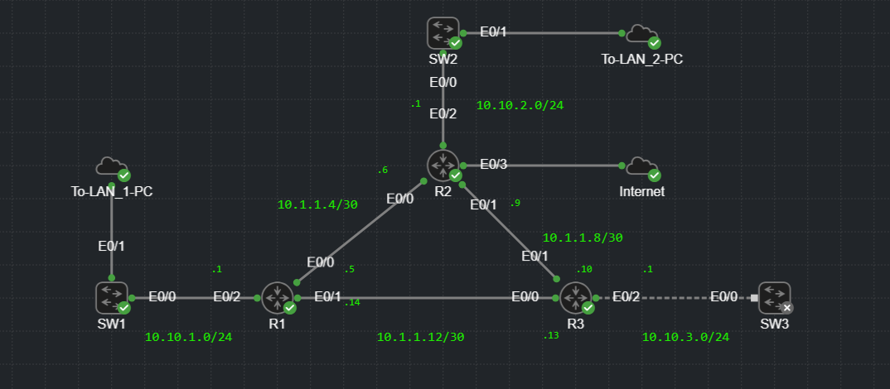

# OSPF-LAB

## 📌 Introduction
This lab demonstrates the configuration and verification of **OSPF (Open Shortest Path First)** in a multi-router environment.  
It consists of three routers (R1, R2, R3), three switches (SW1, SW2, SW3), and multiple LAN segments.  
The setup simulates a small enterprise network with interconnecting point-to-point links and LAN networks.

The main objectives of this lab:
- Understand OSPF neighbor formation.
- Configure OSPF across multiple interfaces and subnets.
- Verify OSPF routing tables and connectivity.
- Test communication between different LANs and external networks.

---

## 🖼 Topology

---

## ⚙ Requirements
Before running this lab, ensure you have:
- **Cisco Modelling Labs** installed.
- Router and switch images (IOS) compatible with OSPF.
- Minimum 8 GB RAM
- VMWare Pro
- Ubuntu/Windows Images for Virtual Machines
---
