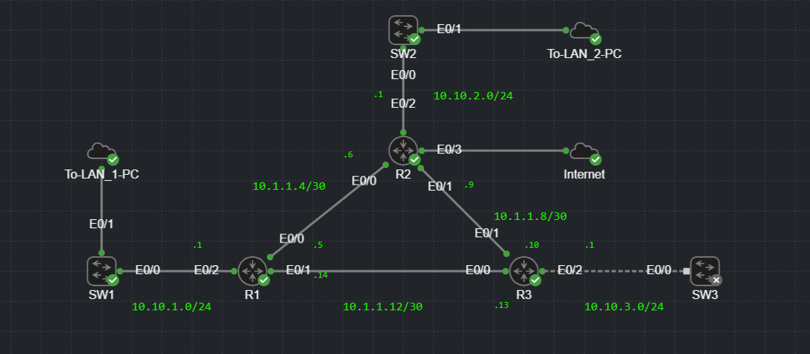

# 🔀 OSPF Routing Lab (Cisco Modeling Labs)

A single-area OSPFv2 lab built in **Cisco Modeling Labs (CML)**, simulating a small enterprise network with three routers, three LAN segments, and internet connectivity via R2.

---

## 📋 Table of Contents

- [Overview](#overview)
- [Topology](#topology)
- [Device Inventory](#device-inventory)
- [IP Addressing Scheme](#ip-addressing-scheme)
- [Link Connections](#link-connections)
- [Lab Objectives](#lab-objectives)
- [Repository Structure](#repository-structure)
- [Lab Setup Guide](#lab-setup-guide)

---

## Overview

This lab demonstrates the configuration and verification of **OSPF (Open Shortest Path First)** across a multi-router environment. It consists of three routers (R1, R2, R3), three switches (SW1, SW2, SW3), three LAN segments, and an internet uplink connected to R2.

The lab simulates how routers in a real network automatically discover each other, share routing information, and find the best path for traffic — without needing to be manually told where everything is.

**Key learning objectives:**

- Configure OSPFv2 across multiple routers and interfaces
- Understand OSPF neighbour formation and adjacency states
- Verify OSPF routing tables and end-to-end connectivity
- Test dynamic route propagation and failover behaviour
- Apply structured IP subnetting across point-to-point and LAN segments

---

## Topology



```
                    [Internet]
                        |
          [SW2]-------[R2]-------[R3]-------[SW3]
      (LAN 2)       /      \               (LAN 3)
                  /          \
                [R1]---------[R1↔R3]
                  |
                [SW1]
              (LAN 1)
```

**Traffic flow summary:**
- R1, R2, and R3 form OSPF neighbour relationships over three point-to-point links
- Each router connects to a local LAN via a switch (SW1, SW2, SW3)
- R2 has an uplink to the internet
- OSPF propagates a default route from R2 so all LAN hosts can reach the internet

---

## Device Inventory

| Device | Role | Platform |
|--------|------|----------|
| R1 | Router | IOL-XE |
| R2 | Router / Internet gateway | IOL-XE |
| R3 | Router | IOL-XE |
| SW1 | Access switch (LAN 1) | IOLL2-XE |
| SW2 | Access switch (LAN 2) | IOLL2-XE |
| SW3 | Access switch (LAN 3) | IOLL2-XE |
| Internet | External connector | CML External |
| To-LAN_1-PC | VM bridge (bridge1) | CML External |
| To-LAN_2-PC | VM bridge (bridge2) | CML External |

---

## IP Addressing Scheme

### LAN Segments

| Network | Subnet | Connected Router | Switch |
|---------|--------|-----------------|--------|
| LAN 1 | 10.10.1.0/24 | R1 | SW1 |
| LAN 2 | 10.10.2.0/24 | R2 | SW2 |
| LAN 3 | 10.10.3.0/24 | R3 | SW3 |

### Point-to-Point Links

| Link | Subnet | R1 / R2 IP | R2 / R3 IP |
|------|--------|-----------|-----------|
| R1 ↔ R2 | 10.1.1.4/30 | .5 | .6 |
| R2 ↔ R3 | 10.1.1.8/30 | .9 | .10 |
| R1 ↔ R3 | 10.1.1.12/30 | .13 | .14 |

> All point-to-point interfaces use /30 subnets (2 usable hosts each), which is standard practice for router-to-router links.

---

## Link Connections

| Link ID | From | Interface | To | Interface |
|---------|------|-----------|-----|-----------|
| l0 | R2 | Ethernet0/2 | SW2 | Ethernet0/0 |
| l1 | R2 | Ethernet0/0 | R1 | Ethernet0/0 |
| l2 | R2 | Ethernet0/1 | R3 | Ethernet0/1 |
| l3 | R1 | Ethernet0/1 | R3 | Ethernet0/0 |
| l4 | SW3 | Ethernet0/0 | R3 | Ethernet0/2 |
| l5 | R1 | Ethernet0/2 | SW1 | Ethernet0/0 |
| l6 | R2 | Ethernet0/3 | Internet | port |
| l7 | SW2 | Ethernet0/1 | To-LAN_2-PC | port |
| l8 | To-LAN_1-PC | port | SW1 | Ethernet0/1 |

---

## Lab Objectives

1. **Configure OSPFv2 (Area 0)** on all three routers across all connected interfaces
2. **Verify neighbour adjacency** — all routers should reach FULL state with their neighbours
3. **Check routing tables** — each router should have OSPF-learned routes to all three LAN subnets
4. **Test end-to-end connectivity** — ping between hosts on LAN 1, LAN 2, and LAN 3
5. **Test internet access** — verify R2 advertises a default route via OSPF so LAN hosts can reach the internet
6. **Simulate a link failure** — shut down one link and observe OSPF reconvergence and traffic rerouting

### Verification Commands

```
# Check OSPF neighbours
show ip ospf neighbor

# Check routing table for OSPF routes
show ip route ospf

# Check OSPF interface details
show ip ospf interface brief

# Ping across LANs (run from a PC on LAN 1)
ping 10.10.2.1
ping 10.10.3.1
```

---

## Repository Structure

```
OSPF-LAB/
├── README.md                ← This file
├── OSPF_Topo.yaml           ← CML lab export (import directly into CML)
├── Configs/                 ← Router startup configurations
│   ├── R1.txt
│   ├── R2.txt
│   └── R3.txt
├── Diagrams/                ← Topology diagrams
│   └── ospf-lab-topology.png
├── Images/                  ← Reference images
└── Screenshots/             ← Verification screenshots
```

---

## Lab Setup Guide

### Prerequisites

- **Cisco Modeling Labs (CML)** 2.x or later (Free tier supported)
- Router images: IOL-XE compatible with OSPFv2
- Switch images: IOLL2-XE
- Minimum **8 GB RAM**
- **VMware Pro** (for attaching VM endpoints to LAN bridges)
- Ubuntu or Windows VM images for LAN endpoint testing

### Import the Lab

1. Open CML and navigate to **Dashboard → Import**
2. Upload `OSPF_Topo.yaml`
3. Start all nodes and wait for them to boot

### Configure VM Bridges (for LAN endpoint testing)

| Bridge | Connected To | LAN |
|--------|-------------|-----|
| bridge1 | SW1 (To-LAN_1-PC) | LAN 1 — 10.10.1.0/24 |
| bridge2 | SW2 (To-LAN_2-PC) | LAN 2 — 10.10.2.0/24 |

Attach your VM's network adapter to the corresponding bridge in VMware to place it on the correct LAN segment.

### Apply Router Configs

Copy the contents of each file from the `Configs/` folder into the corresponding router's CLI:

```
Router# configure terminal
Router(config)# [paste config here]
Router(config)# end
Router# write memory
```

### Verify the Lab

Once all configs are applied, run the following checks:

```
R2# show ip ospf neighbor
R2# show ip route
R1# ping 10.10.3.1 source 10.10.1.1
```

All three routers should show OSPF neighbours in **FULL** state, and pings between all LAN subnets should succeed.
